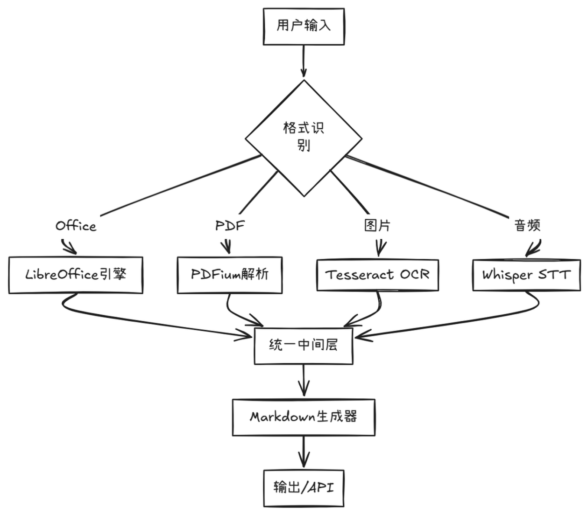
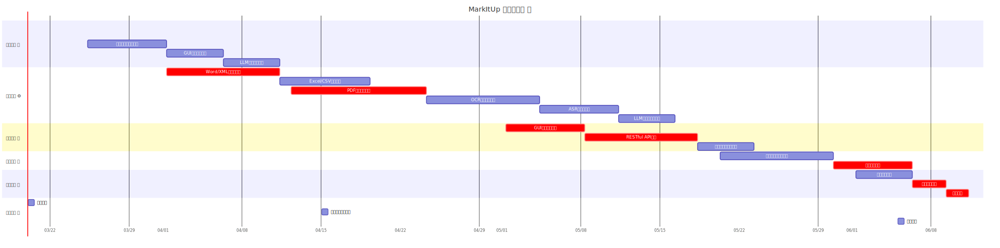

# `MarkItUp`
## XJTU RUST 课程设计开题报告

<!--
#### -- 一款将各种文件转换为 Markdown 的实用工具✨

- 📅 2025年3月20日
- 👥 王鸣谦 | 郑诗棪 | 李雨轩

***`MarkItUp`* : 一款将各种文件转换为 Markdown 的实用工具✨**
-->

<!-- 插入html空行 -->

 📅 2025年3月20日 | 👥 王鸣谦 · 郑诗棪 · 李雨轩  

  

    

      📁➡️📝
    

  

  

    

      MarkItUp : 一款将各种文件转换为 Markdown 的实用工具✨
    

  

---
## Contents

- 1. 🌍 项目背景与痛点分析
- 2. 🎯 项目目标与核心价值
- 3. 🛠️ 技术方案与创新点
- 4. 📅 项目计划与任务安排

------

## 1. 🌍 项目背景与痛点分析

---

### 行业现状 📈  

- 非结构化数据逐年增长⬆️
- 开发者平均每周花大量时间处理格式问题⏳
- 企业文档数字化成本占IT预算日益增长💸  
- Markdown已成为技术文档的通用语言💻
- LLM 对于 Markdown 的支持程度较高，AI 训练的黄金格式💡

---

### 用户痛点 😫  

<table>
    <tr>
        <th>常见场景</th>
        <th>现存问题</th>
    </tr>
    <tr>
        <td>技术博客写作✍️</td>
        <td>Word→MD格式错乱</td>
    </tr>
    <tr>
        <td>数据报告分享📊</td>
        <td>Excel表格转换丢失样式</td>
    </tr>
    <tr>
        <td>学术论文协作🎓</td>
        <td>PDF注释无法保留</td>
    </tr>
    <tr>
        <td>AI训练数据准备🤖</td>
        <td>多格式数据清洗耗时</td>
    </tr>
</table>

------

## 2. 🎯 项目目标与核心价值 

---

### 产品定位 🧭  
**「构建文档世界的巴别塔」**  
- 统一格式的翻译官 📜 → 📄 → 📝  
- 智能处理的魔法师 🧙 (OCR/ASR/AI)  
- 跨平台的瑞士军刀 🔧 (Win/Mac/Linux/Web)

---

### 产品目标 🔦

- 全能文件处理大师 🚀
    - Office全家桶?小菜一碟!Word、PowerPoint、Excel通通搞定!
    - 多媒体文件?没问题!图片、音讯档案也能轻松处理!
    - 网页和数据格式?HTML、JSON、XML、CSV,样样精通!

- 智能处理能力 🧠
    - 不只简单的格式转换,MarkItUp还能使用OCR技术从图片中提取文字!
    - 音讯档案?它还能帮你做语音识别呢!

- LLM训练的好帮手 🤖
    - 将各种格式转换为Markdown,为LLM训练提供了丰富的上下文资讯。
    - 这意味着你的AI应用可以更准确、更相关地回应用户的需求!

------

## 3. 🛠️ 技术方案与创新点

---

### 项目目标 🚧

1. 全能文件转换工具
    - 支持将 Word、Excel、PowerPoint、PDF、HTML、JSON等文件格式转换为 Markdown
2. 智能处理能力
    - 支持使用 OCR 技术从图片中提取文字，支持音讯档案的语音识别
3. 直观的用户界面
    - 支持图形用户界面
4. 易用的API
    - 提供易用的 API 接口，方便其他应用调用（如 LLM 训练）

---

### 技术架构 🏗️

    

---

### 创新亮点 ✨

1. **多格式解析引擎**
    - 使用 Rust + WASM 实现高性能的多格式解析引擎
2. **智能内容提取**
    - 使用 Tesseract OCR + Whisper ASR 实现智能内容提取
3. **跨平台支持**
    - 使用基于 TAURI 的 GUI 框架实现跨平台支持
4. **🤖 AI增强**
    - 自动生成文档摘要和标签

------

## 4. 📅 项目计划与任务安排

---

### 项目里程碑计划 📅

---

### 任务分工 🤝

- 每周一次项目进度会议
- 每日一次代码提交
- 每周一次代码Review
<table>
    <tr>
        <th>成员</th>
        <td>王鸣谦</td>
        <td>郑诗棪</td>
        <td>李雨轩</td>
    </tr>
    <tr>
        <th>职责</th>
        <td>核心引擎开发🔧</td>
        <td>AI模块集成🧠</td>
        <td>GUI/API开发💻</td>
    </tr>
</table>

------

## Thanks! 🙏

在这个数据为王的时代,掌握了MarkItUp,就等于掌握了转化各种文档为结构化数据的魔法钥匙

准备好释放你的创造力了吗?MarkItUp,让文档处理不再是噩梦,而是一场充满惊喜的冒险!🌟

期待与您交流！ 🚀

