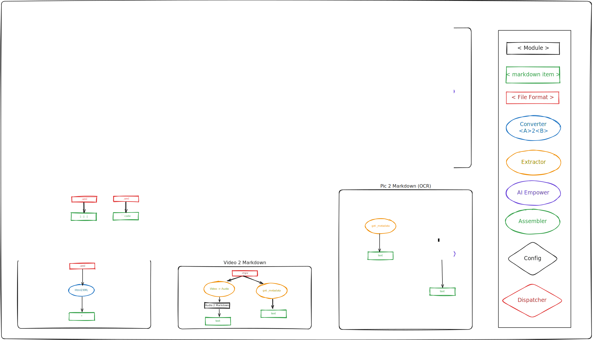

# `MarkItUp`
## XJTU RUST 课程设计中期报告

📅 2025年11月15日 | 👥 王鸣谦 · 郑诗棪 · 李雨轩 | 📁 ➡️ 📝

MarkItUp : Markdown is all you need (A converter for all formats)

<!-- Conversion Rate: 98.7% | Core Engine: v0.9.1 -->

------
## Content

- [当前进展概览🎯](#当前进展概览)
<!-- - [技术突破展示🔧](#技术突破展示) -->
- [问题与尚未完成⏳](#问题与尚未完成)
- [下一阶段计划🚀](#下一阶段计划)
- [总结与展望🔮](#总结与展望)

------

## 当前进展概览🎯

- [目标回顾](目标回顾)
- [当前各模块架构](当前各模块架构)
- [当前进展](当前进展)

---

### 目标回顾

- **核心目标**：实现All to Markdown的转换器
- **核心功能**：支持图片、Office、PDF、HTML、XML、音频等格式转换为Markdown
- **产品定位**：同时面向开发者、知识工作者和普通用户

---

### 当前各模块架构

---

### `Pic2Markdown` 模块
- 将图片转换为Markdown格式： ``
- 通过AI模型识别图片内容，智能提供标题

---

### `Office2Markdown` 模块
- 将Office文档转换为Markdown格式

---

### `PDF2Markdown` 模块
- 将PDF文档转换为Markdown格式

---

### `HTML2Markdown` 模块
- 将HTML文档转换为Markdown格式

---

### `XML2Markdown` 模块
- 将XML文档转换为Markdown格式

---

### `Audio2Markdown` 模块
- 将音频文件转换为Markdown格式(MetaData + Transcription)

------

## 问题与尚未完成⏳

- Offices的XML解析问题：一个漂亮的界面掩盖了界面下很多丑陋的实现
- PDF的解析是一个大坑，`OCR + Ollama`结合效果不稳定
- 音频文件转换速度慢，现为本地vosk模型

- 🖥️ 前端界面未开发，目前无 UI 原型
<!-- 为开发者提供接口： -->
- 🔌 接口未开发，当前仅提供命令行工具
- ⚙️ 代码需要重构：存在模块风格不统一、层次结构混乱的问题（代码洁癖）
- 📜 文档需要完善：目前文档的并未

------

## 下一阶段计划🚀

- 🖥️ 前端开发：基于 Tauri 实现跨平台界面原型
- 🔌 接口开发：提供命令行工具和 Rust 接口,提供良好的文档
- 🚀 AI Empower环节优化性能
- 🔄 完成代码重构：统一编码风格，完善各模块文档
- 🧪 测试与统计：设计测试方案，特别是涉及到AI Empower的环节

------

## 总结与展望🔮
- **总结**：
  - 目前各模块的核心功能已经实现，整体架构设计合理
  - 目前的进展符合预期，后续需要在前端和接口开发上加大力度
- **展望**：
  - 👨🏻 + {📚, ✉️, 📋, 📊, 💽, ...} = 🤖✴️
  - 👨🏻 + 📃.md = 🤖💓
  - {📚, ✉️, 📋, 📊, 💽, ...} + MarkItUp = 📃.md

